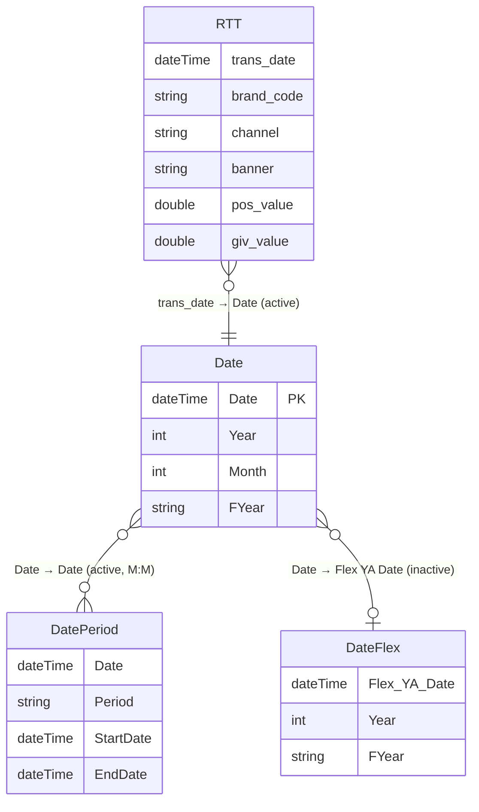

# Template_Databricks – Power BI Semantic Model Documentation

> *Auto-generated documentation.*

## Table of Contents
1. [Overview](#overview)
2. [Table Relationships](#table-relationships)
3. [Tables and Columns](#tables-and-columns)
4. [Measures](#measures)
5. [Row-Level Security](#row-level-security)
6. [Data Sources](#data-sources)

---

## Overview

The **Template_Databricks** semantic model is a sales analytics model that connects to **Azure Databricks** (Unity Catalog) as its primary data source. It provides gross-invoice-value (GIV) and point-of-sale (POS) metrics sliced by brand, channel, banner, and product category, supported by a fully-featured calendar dimension and flexible date-period selection helpers.

| Property | Value |
|---|---|
| Tables | 7 |
| Relationships | 3 |
| Measures | 7 |
| Row-Level Security Roles | 0 |
| Primary Data Source | Azure Databricks (Unity Catalog `bi_gm_prd`) |
| Secondary Data Source | SharePoint Online |

---

## Table Relationships



> **Note:** The relationship between `Date` and `DateFlex` is **inactive** and is activated on demand via `USERELATIONSHIP()` in the `Rows Flex` measure to support year-ago flexible date comparisons.

---

## Tables and Columns

### RTT *(Fact Table)*

Sales transaction fact table sourced from Azure Databricks. Contains daily aggregated GIV and POS metrics by brand, channel, and category.

| Column | Data Type | Description |
|---|---|---|
| brand_code | Text | Brand identifier code |
| trans_date | Date | Transaction date |
| channel | Text | Sales channel (org channel name) |
| banner | Text | Retailer banner (org banner name) |
| category2_code | Text | Product category level-2 code |
| category | Text | Product category level-2 name (English) |
| brand | Text | Brand name (English) |
| giv_value | Decimal | Gross Invoice Value (current period) |
| giv_value_ya | Decimal | Gross Invoice Value (year-ago) |
| giv_oo | Decimal | GIV Open Orders (month-to-date) |
| giv_oo_ya | Decimal | GIV Open Orders (year-ago MTD) |
| pos_value | Decimal | POS offtake value (current period) |
| pos_value_ya | Decimal | POS offtake value (year-ago) |

---

### Date *(Calendar Dimension)*

Auto-generated calendar table covering a rolling 2-year window (from 1 January, two years ago, through today). Classified as a `Time` table.

| Column | Data Type | Description |
|---|---|---|
| Date | Date (Key) | Calendar date |
| Year | Integer | Calendar year |
| Month | Integer | Month number |
| Start of Month | Date | First day of the month |
| End of Month | Date | Last day of the month |
| Day of Week | Integer | Day-of-week number |
| Day of Year | Integer | Day-of-year number |
| Quarter | Integer | Calendar quarter |
| Start of Quarter | Date | First day of the quarter |
| End of Quarter | Date | Last day of the quarter |
| Week of Year | Integer | ISO week of year |
| Week of Month | Integer | Week of month |
| Start of Week | Date | Monday of the week |
| End of Week | Date | Sunday of the week |
| Month Offset | Integer | Months relative to today (0 = current month) |
| Year Offset | Integer | Years relative to today |
| Quarter Offset | Integer | Quarters relative to today |
| Day Offset | Integer | Days relative to today |
| YearMonth | Integer | YYYYMM integer |
| Months | Integer | Month number (alias) |
| WeekDay | Text | Weekday name |
| Quarters | Text | Quarter label |
| Days in Month | Integer | Total days in the month |
| Week | Integer | Week number |
| YYMM | Integer | YYMM integer |
| Is_MTD | Text | "Y" if date falls within month-to-date |
| Is_QTD | Text | "Y" if date falls within quarter-to-date |
| Is_YTD | Text | "Y" if date falls within year-to-date |
| Is_Weekend | Text | "Y" for Saturday/Sunday |
| FYear | Text | Fiscal year label |
| FQuarter | Integer | Fiscal quarter number |
| FQuarters | Text | Fiscal quarter label |
| FYQuarter | Text | Fiscal year + quarter label |
| YearQuarter | Text | Calendar year + quarter label |
| YearWeek | Text | Year + week label |
| YearWeeks | Text | Year + weeks label |
| Week Offset | Integer | Weeks relative to today |
| FY | Text | Fiscal year label (display) |
| Is_FYTD | Text | "Y" if date falls within fiscal-year-to-date |
| Day of Month | Integer | Day number within the month |
| Day of Quarter | Integer | Day number within the quarter |
| Week of Quarter | Integer | Week number within the quarter |
| Month of Quarter | Integer | Month number within the quarter |
| YearHalf | Text | Calendar year half label |
| FYHalf | Text | Fiscal year half label |
| YearMonths | Text | Year + month label |
| YearQuarters | Text | Year + quarters label |
| DatesWithSales | Boolean | Calculated – TRUE if date ≤ latest RTT transaction date |
| YMonth | Text | Year-month label (display) |
| YM | Text | YM compact label |
| Is_T-1 | Text | "Y" if date is up to and including yesterday |

---

### DatePeriod *(Date Period Slicer)*

Computed M-query table providing named rolling date periods (MTD, QTD, FYTD, etc.). Each row expands into individual dates so it can join to the `Date` table.

| Column | Data Type | Description |
|---|---|---|
| Period | Text | Period label (e.g., "MTD", "QTD", "FYTD", "CYTD", "P1M" … "P12M") |
| Sort | Integer | Sort order for slicers (hidden) |
| StartDate | Date | Start date of the period |
| EndDate | Date | End date of the period |
| Date | Date | Expanded individual dates within the period (hidden – used for relationship) |

---

### DateFlex *(Year-Ago Flexible Date Helper)*

Calculated table derived from the `Date` table, restricted to dates where `Is_T-1 = "Y"` (up to yesterday). Used to drive year-ago comparisons through an inactive relationship, enabling flexible prior-year calculations without disturbing the primary date filter.

| Column | Data Type | Description |
|---|---|---|
| Flex YA Date | Date | Calendar date (shifted for YA comparison) |
| Year | Integer | Calendar year |
| FYear | Text | Fiscal year |
| YearMonth | Integer | YYYYMM integer |

---

### V_Date *(Field Parameter – Date Granularity)*

Calculated field-parameter table enabling report users to dynamically select the date granularity (Year, CY Half, FY, FY Half, FYQuarter, YearMonth) for visuals.

| Column | Data Type | Description |
|---|---|---|
| V_Date | Text | Display label for the selected granularity |
| Date | (hidden) | Column reference used by the parameter |
| sort | Integer (hidden) | Sort order |

---

### V_Unit *(Field Parameter – Display Unit)*

Static calculated table that lets users choose the numeric display unit: millions (MM), thousands (M), or base.

| Column | Data Type | Description |
|---|---|---|
| Unit | Text | Unit label: "MM", "M", or "Base" |
| Sort | Integer (hidden) | Sort order |
| Format | Text | DAX format string for the selected unit |

---

### V_Meta *(Model Metadata)*

Calculated table that surfaces model metadata (calculated columns, measures, and calculated tables) using `INFO.VIEW.*` functions. Useful for documentation and governance tooling.

| Column | Data Type | Description |
|---|---|---|
| Type | Text | Object type: "Column", "Measure", or "Table" |
| Name | Text | Object name |
| Description | Text | Object description |
| Location | Text | Parent table name |
| Expression | Text | DAX expression |

---

## Measures

### POS IYA *(table: RTT)*

**Business Logic:** Point-of-Sale Index Year-Ago. Calculates current POS offtake value as a percentage of the prior-year equivalent, providing a simple year-on-year performance index. A value of 100 = flat vs prior year; >100 = growth.

```dax
POS IYA = DIVIDE(SUM(RTT[pos_value]), SUM(RTT[pos_value_ya])) * 100
```

| Property | Value |
|---|---|
| Format String | `0` |
| Display Folder | *(none)* |

---

### GIV IYA *(table: RTT)*

**Business Logic:** GIV Index Year-Ago. Calculates current Gross Invoice Value as a percentage of the prior-year equivalent. A value of 100 = flat vs prior year; >100 = growth.

```dax
GIV IYA = DIVIDE(SUM(RTT[giv_value]), SUM(RTT[giv_value_ya])) * 100
```

| Property | Value |
|---|---|
| Format String | `0` |
| Display Folder | *(none)* |

---

### POS Daily *(table: RTT)* — 日销POS

**Business Logic:** Average daily Point-of-Sale offtake value over the selected period. Divides total POS value by the count of distinct transaction dates to produce a per-day average.

```dax
POS Daily = DIVIDE(SUM(RTT[pos_value]), DISTINCTCOUNT(RTT[trans_date]))
```

| Property | Value |
|---|---|
| Format String | `#,0` |
| Display Folder | *(none)* |

---

### FYTD POS *(table: RTT)*

**Business Logic:** Fiscal Year-to-Date POS. Total Point-of-Sale offtake value from the start of the current fiscal year to the latest available date. Uses the `Date[Is_FYTD]` flag column to restrict the calculation to the FYTD window regardless of any date slicer selection.

```dax
FYTD POS = CALCULATE(SUM(RTT[pos_value]), 'Date'[Is_FYTD] = "Y")
```

| Property | Value |
|---|---|
| Format String | `#,0` |
| Display Folder | *(none)* |

---

### FYTD GIV *(table: RTT)*

**Business Logic:** Fiscal Year-to-Date GIV. Total Gross Invoice Value from the start of the current fiscal year to the latest available date. Uses the `Date[Is_FYTD]` flag column to restrict the calculation to the FYTD window regardless of any date slicer selection.

```dax
FYTD GIV = CALCULATE(SUM(RTT[giv_value]), 'Date'[Is_FYTD] = "Y")
```

| Property | Value |
|---|---|
| Format String | `#,0` |
| Display Folder | *(none)* |

---

### Select Date *(table: Date)*

**Business Logic:** Shows the currently selected date range as a text label in the format `YYYY-MM-DD - YYYY-MM-DD`. Useful as a dynamic report header or card visual to communicate the active filter context to users.

```dax
Select Date = MIN('Date'[Date]) & "-" & MAX('Date'[Date])
```

| Property | Value |
|---|---|
| Format String | *(general text)* |
| Display Folder | *(none)* |

---

### Rows Flex *(table: DateFlex)*

**Business Logic:** Calculates the row count using the inactive `Date → DateFlex[Flex YA Date]` relationship. It removes all standard `Date` filters and activates the inactive relationship, allowing year-ago flexible date calculations to operate independently from the main date slicer context.

```dax
Rows Flex =
CALCULATE(
    [Row#],
    REMOVEFILTERS('Date'),
    USERELATIONSHIP('Date'[Date], 'DateFlex'[Flex YA Date])
)
```

| Property | Value |
|---|---|
| Format String | `0` |
| Display Folder | *(none)* |

---

## Row-Level Security

No Row-Level Security roles are defined in this semantic model. All users with access to the dataset have unrestricted access to all data.

---

## Data Sources

### 1. Azure Databricks (Primary – Fact Data)

The **RTT** table connects to **Azure Databricks** using the native `Databricks.Catalogs` Power Query connector and executes a native SQL query for performance (with folding enabled).

| Parameter | Value |
|---|---|
| `_DBRServer` | `adb-6166818014713788.0.databricks.azure.cn` |
| `_DBRPath` (SQL Warehouse) | `/sql/1.0/warehouses/f2ed516212c746dd` |
| `_DBRCatalog` (Unity Catalog) | `bi_gm_prd` |
| Source table | `cdl_corp_prd.ds.tb_corp_prod_sales_inv_giv_gtin_daily_fact` |

**SQL executed at refresh:**

```sql
SELECT
     cast(trans_date as date)
    ,org_channel_name                          as channel
    ,org_banner_name                           as banner
    ,product_gtin_category_2_code              as category2_code
    ,product_gtin_category_2_name_en           as category
    ,product_gtin_brand_code                   as brand_code
    ,product_gtin_brand_en                     as brand

    ,SUM(spm_no_transit_gross_invoice_value)        as giv_value
    ,SUM(spm_ya_no_transit_gross_invoice_value)     as giv_value_ya
    ,SUM(spm_mtd_open_order_gross_invoice_value)    as giv_oo
    ,SUM(spm_ya_mtd_open_order_gross_invoice_value) as giv_oo_ya

    ,SUM(pos_offtake_value)                         as pos_value
    ,SUM(pos_ya_offtake_value)                      as pos_value_ya

FROM cdl_corp_prd.ds.tb_corp_prod_sales_inv_giv_gtin_daily_fact
WHERE 1=1
  AND trans_date >= '2026-01-01'
  AND trans_date < current_date()
GROUP BY ALL
```

> **`_FilterRows` parameter:** When set to a positive integer, only the first N rows are returned. Set to `0` (default) to load all rows. This is useful for development and testing.

---

### 2. SharePoint Online (Secondary – Reference Data)

A shared expression `SP_Source` provides a shared Power Query connection to a **SharePoint Online** site. Individual tables can consume this shared source.

| Parameter | Value |
|---|---|
| `_SP_Site` | `https://pgone.sharepoint.com/sites/zz_test` |
| SharePoint folder | `BI` (document library) |

```powerquery
let
    Source = SharePoint.Contents(_SP_Site, [ApiVersion = 15]),
    SelectFolder = Source{[Name="BI"]}[Content]
in
    SelectFolder
```

---

### 3. Computed / In-Model Sources

The following tables are generated entirely within the model (no external source):

| Table | Computation Method | Description |
|---|---|---|
| Date | Power Query M | Generates a rolling 2-year date series from 1 Jan (current year − 2) through today |
| DatePeriod | Power Query M | Expands named rolling periods (MTD, QTD, FYTD, etc.) into daily rows |
| DateFlex | DAX (Calculated Table) | Filters `Date` table to T−1 dates for flexible year-ago comparisons |
| V_Date | DAX (Calculated Table) | Field parameter for dynamic date granularity selection |
| V_Unit | DAX (Calculated Table) | Static lookup for display unit selection (MM / M / Base) |
| V_Meta | DAX (Calculated Table) | Model metadata surfaced via `INFO.VIEW.*` functions |

---

### Incremental Refresh Parameters

| Parameter | Type | Default Value | Purpose |
|---|---|---|---|
| `RangeStart` | DateTime | `2025-07-01 00:00:00` | Incremental refresh window start |
| `RangeEnd` | DateTime | `2025-12-31 00:00:00` | Incremental refresh window end |
