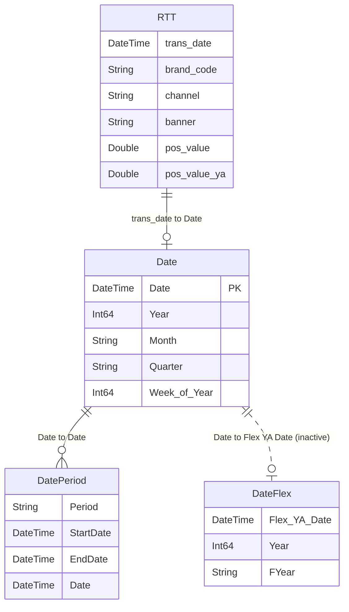

# Template_Databricks – Power BI Semantic Model Documentation

> *Auto-generated documentation.*

## Table of Contents
1. [Overview](#overview)
2. [Table Relationships](#table-relationships)
3. [Tables and Columns](#tables-and-columns)
4. [Measures](#measures)
5. [Row-Level Security](#row-level-security)
6. [Data Sources](#data-sources)

## Overview

The **Template_Databricks** semantic model is designed to analyze sales and performance data from Databricks sources. This model provides insights into retail transactions, brand performance, and temporal analysis capabilities.

### Model Statistics

| Metric | Count |
|--------|-------|
| **Tables** | 7 |
| **Relationships** | 3 |
| **Measures** | 3 |
| **Compatibility Level** | 1702 |

### Tables Summary

- **RTT**: Retail Transaction data (13 columns, 1 measure)
- **Date**: Calendar table with extensive date attributes (51 columns, 1 measure, 3 calendars)
- **DatePeriod**: Period-based date filtering (5 columns)
- **DateFlex**: Flexible year-ago date comparison (4 columns, 1 measure)
- **V_Meta**: Metadata viewer (5 columns)
- **V_Date**: Date selection parameter (3 columns)
- **V_Unit**: Unit formatting options (3 columns)

## Table Relationships

The model uses a star schema with the Date table as the central dimension:



### Relationship Details

1. **RTT → Date** (Active)
   - From: `RTT[trans_date]` (Many)
   - To: `Date[Date]` (One)
   - Cross-filtering: One Direction
   - Purpose: Links transaction dates to the calendar

2. **Date → DatePeriod** (Active)
   - From: `Date[Date]` (Many)
   - To: `DatePeriod[Date]` (Many)
   - Cross-filtering: One Direction
   - Purpose: Enables period-based analysis (MTD, QTD, FYTD, etc.)

3. **Date → DateFlex** (Inactive)
   - From: `Date[Date]` (Many)
   - To: `DateFlex[Flex YA Date]` (One)
   - Cross-filtering: One Direction
   - Purpose: Supports flexible year-ago comparisons via USERELATIONSHIP

## Tables and Columns

### RTT (Retail Transaction Table)

The main fact table containing retail transaction data aggregated from Databricks.

| Column | Data Type | Description | Format | Summarization |
|--------|-----------|-------------|--------|---------------|
| brand_code | String | Brand identifier code | - | None |
| trans_date | DateTime | Transaction date | yyyy-mm-dd | None |
| channel | String | Organization channel name | - | None |
| banner | String | Organization banner name | - | None |
| category2_code | String | Product category level 2 code | - | None |
| category | String | Product category level 2 name | - | None |
| brand | String | Product brand name | - | None |
| giv_value | Double | Gross invoice value | #,0 | Sum |
| giv_value_ya | Double | Gross invoice value year ago | - | Sum |
| giv_oo | Double | Open order gross invoice value | - | Sum |
| giv_oo_ya | Double | Open order gross invoice value year ago | - | Sum |
| pos_value | Double | Point of sale value | #,0 | Sum |
| pos_value_ya | Double | Point of sale value year ago | - | Sum |

**Measure**: `POS IYA` - Calculates index year ago percentage for POS value

---

### Date (Calendar Table)

Comprehensive calendar table with extensive date attributes for time intelligence analysis.

| Column | Data Type | Key | Hidden | Description | Display Folder |
|--------|-----------|-----|--------|-------------|----------------|
| Date | DateTime | ✓ | | Primary date field | |
| Year | Int64 | | | Calendar year | |
| Month | String | | | Month abbreviation (sorted by Months) | |
| Start of Month | DateTime | | ✓ | First day of month | Offset |
| End of Month | DateTime | | ✓ | Last day of month | Offset |
| Day of Week | Int64 | | | Day number in week | Of |
| Day of Year | Int64 | | | Day number in year | Of |
| Day of Month | Int64 | | | Day number in month | Of |
| Day of Quarter | Int64 | | | Day number in quarter | Of |
| Quarter | String | | | Quarter label (Q1-Q4) | |
| Start of Quarter | DateTime | | ✓ | First day of quarter | Offset |
| End of Quarter | DateTime | | ✓ | Last day of quarter | Offset |
| Week of Year | Int64 | | | ISO week number | Of |
| Week of Month | Int64 | | | Week number within month | Of |
| Week of Quarter | Int64 | | | Week number within quarter | Of |
| Start of Week | DateTime | | ✓ | First day of week | Offset |
| End of Week | DateTime | | ✓ | Last day of week | Offset |
| Month Offset | Int64 | | | Months from today | Offset |
| Year Offset | Int64 | | | Years from today | Offset |
| Quarter Offset | Int64 | | | Quarters from today | Offset |
| Day Offset | Int64 | | | Days from today | Offset |
| Week Offset | Int64 | | | Weeks from today | Offset |
| YearMonth | Int64 | | | Year-month as integer (YYYYMM) | |
| YMonth | String | | | Year-month label (sorted) | |
| YYMM | String | | | Year-month display (yyyy MMM) | |
| YM | DateTime | | | Year-month date | |
| YearQuarter | String | | | Year-quarter label | |
| YearWeek | String | | | Year-week label | |
| YearHalf | String | | | Calendar year half | |
| WeekDay | String | | | Day name abbreviation (sorted by Day of Week) | Of |
| Week | String | | | Week label (sorted by Week of Year) | |
| Is_MTD | String | | | Month-to-date flag (Y/N) | |
| Is_QTD | String | | | Quarter-to-date flag (Y/N) | |
| Is_YTD | String | | | Year-to-date flag (Y/N) | |
| Is_FYTD | String | | | Fiscal year-to-date flag (Y/N) | |
| Is_T-1 | String | | | Prior to today flag (Y/N) | |
| Is_Weekend | String | | | Weekend flag (Y/N) | |
| FYear | String | | | Fiscal year label | |
| FQuarter | String | | | Fiscal quarter label (sorted by FQuarters) | |
| FYQuarter | String | | | Fiscal year-quarter label | |
| FYHalf | String | | | Fiscal year half | |
| Month of Quarter | Int64 | | | Month position in quarter | Of |
| DatesWithSales | Calculated | | | Flag for dates with sales data | |
| Months | Int64 | | ✓ | Month number (for sorting) | |
| Quarters | Int64 | | ✓ | Quarter number (for sorting) | |
| FQuarters | Int64 | | ✓ | Fiscal quarter number (for sorting) | |
| Days in Month | Int64 | | ✓ | Total days in month | |
| YearMonths | Int64 | | ✓ | Year-month composite (for sorting) | |
| YearQuarters | Int64 | | ✓ | Year-quarter composite (for sorting) | |
| YearWeeks | Int64 | | ✓ | Year-week composite (for sorting) | |
| FY | String | | ✓ | Fiscal year code | |

**Measure**: `Select Date` - Displays selected date range

**Calendar Definitions**: 3 calendar structures defined for time intelligence

---

### DatePeriod

Period-based date filtering table for common analysis periods (MTD, QTD, FYTD, etc.).

| Column | Data Type | Hidden | Description |
|--------|-----------|--------|-------------|
| Period | String | | Period label (MTD, QTD, FYTD, CYTD, P1M, P3M, P6M, P12M) |
| Sort | Int64 | ✓ | Sort order for periods |
| StartDate | DateTime | | Period start date |
| EndDate | DateTime | | Period end date |
| Date | DateTime | ✓ | Individual dates within period (expanded) |

---

### DateFlex

Flexible year-ago comparison dates for alternative calendar analysis.

| Column | Data Type | Description |
|--------|-----------|-------------|
| Flex YA Date | Calculated | Flexible year-ago date |
| Year | Calculated | Calendar year |
| FYear | Calculated | Fiscal year |
| YearMonth | Calculated | Year-month identifier |

**Measure**: `Rows Flex` - Row count using inactive relationship to DateFlex

---

### V_Meta (Metadata Viewer)

Calculated table displaying metadata about the model objects.

| Column | Data Type | Description |
|--------|-----------|-------------|
| Type | Calculated | Object type (Table, Measure, Column) |
| Name | Calculated | Object name |
| Description | Calculated | Object description |
| Location | Calculated | Object location |
| Expression | Calculated | Object expression/formula |

---

### V_Date (Date Parameter)

Parameter table for date selection in visuals.

| Column | Data Type | Hidden | Description |
|--------|-----------|--------|-------------|
| V_Date | Calculated | | Date display value (sorted by sort) |
| Date | Calculated | ✓ | Actual date value |
| sort | Calculated | ✓ | Sort order |

---

### V_Unit (Unit Parameter)

Parameter table for selecting display units (format strings).

| Column | Data Type | Hidden | Description |
|--------|-----------|--------|-------------|
| Unit | Calculated | | Unit label (sorted by Sort) |
| Sort | Calculated | ✓ | Sort order |
| Format | Calculated | | Format string for the unit |

## Measures

### POS IYA
**Table**: RTT
**Display Folder**: (root)

**Business Logic**: Calculates the Index Year Ago (IYA) percentage by comparing current POS value to prior year POS value. Returns the percentage change expressed as an index (e.g., 105 means 5% increase).

**DAX Code**:
```dax
DIVIDE(SUM(RTT[pos_value]),SUM(RTT[pos_value_ya]))*100
```

**Format**: `0` (whole number)

---

### Select Date
**Table**: Date
**Display Folder**: (root)

**Business Logic**: Displays the selected date range by concatenating the minimum and maximum dates in the current filter context, separated by a hyphen.

**DAX Code**:
```dax
MIN('Date'[Date]) &"-"& MAX('Date'[Date])
```

**Format**: (default text format)

---

### Rows Flex
**Table**: DateFlex
**Display Folder**: (root)

**Business Logic**: Calculates row count using the inactive relationship between Date and DateFlex tables, allowing for flexible year-ago comparisons independent of the active date context.

**DAX Code**:
```dax
CALCULATE([Row#],REMOVEFILTERS('Date'),USERELATIONSHIP('Date'[Date],'DateFlex'[Flex YA Date]))
```

**Format**: `0` (whole number)

**Note**: This measure references another measure `[Row#]` which should be defined elsewhere in the model.

## Row-Level Security

**Status**: No row-level security roles are currently defined in this model.

All users have access to all data in the semantic model. If data access restrictions are required, security roles with filter expressions should be configured.

## Data Sources

### Primary Data Source: Databricks

The model connects to **Azure Databricks** using parameterized connection strings.

**Connection Parameters**:
- **Server**: `adb-6166818014713788.0.databricks.azure.cn`
- **Path**: `/sql/1.0/warehouses/f2ed516212c746dd`
- **Catalog**: `bi_gm_prd`

### Table Data Sources

#### RTT Table (Import Mode)
**Source Type**: Databricks SQL Query
**Query Group**: Fact

**Source**: Databricks catalog `cdl_corp_prd.ds.tb_corp_prod_sales_inv_giv_gtin_daily_fact`

The RTT table imports data from a Databricks SQL query that:
- Aggregates daily sales and inventory data by brand, channel, banner, and category
- Includes both current year and year-ago metrics for comparison
- Filters data from 2026-01-01 to the current date
- Supports optional row filtering via the `_FilterRows` parameter
- Includes GIV (Gross Invoice Value), open order, and POS (Point of Sale) metrics

**Key Metrics Sourced**:
- GIV Value (current and YA)
- Open Order GIV (current and YA)
- POS Value (current and YA)

---

#### Date Table (Import Mode)
**Source Type**: Power Query M
**Source**: Generated calendar table

The Date table is dynamically generated using Power Query:
- **Date Range**: From 2 years prior to current year through today
- **First Day of Week**: Monday
- **Refresh**: Automatically updates based on `DateTime.LocalNow()`
- **Features**:
  - Comprehensive calendar attributes (day, week, month, quarter, year)
  - Fiscal year calculations (July to June)
  - Time intelligence flags (MTD, QTD, YTD, FYTD)
  - Offset calculations from current date
  - Weekend identification

---

#### DatePeriod Table (Import Mode)
**Source Type**: Power Query M
**Source**: Generated period definitions

The DatePeriod table generates predefined analysis periods:
- **MTD**: Month to Date
- **QTD**: Quarter to Date
- **FYTD**: Fiscal Year to Date (July-June)
- **CYTD**: Calendar Year to Date
- **P1M**: Previous 1 Month
- **P3M**: Previous 3 Months
- **P6M**: Previous 6 Months
- **P12M**: Previous 12 Months

Each period expands to individual dates using `List.TransformMany()` for flexible filtering.

---

#### Calculated Tables

The following tables are calculated tables (no external data source):

- **V_Meta**: Metadata viewer - generates a list of model objects dynamically
- **V_Date**: Date parameter - provides date selection options
- **V_Unit**: Unit parameter - provides format string options
- **DateFlex**: Flexible year-ago dates - calculated from Date table for alternative comparisons

### Parameters

The model uses the following Power Query parameters:

| Parameter | Value | Purpose |
|-----------|-------|---------|
| _DBRServer | `adb-6166818014713788.0.databricks.azure.cn` | Databricks server address |
| _DBRPath | `/sql/1.0/warehouses/f2ed516212c746dd` | Databricks warehouse path |
| _DBRCatalog | `bi_gm_prd` | Databricks catalog name |
| _FilterRows | (numeric) | Row limit for testing (0 = no limit) |
| RangeStart | (date) | Date range start parameter |
| RangeEnd | (date) | Date range end parameter |
| _SP_Site | (text) | SharePoint site URL |
| SP_Source | (text) | SharePoint source path |

---

*Documentation generated on 2026-04-24*
